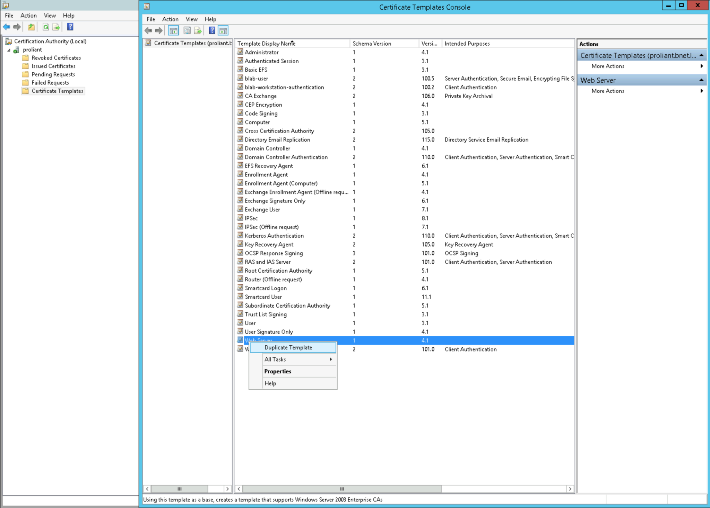
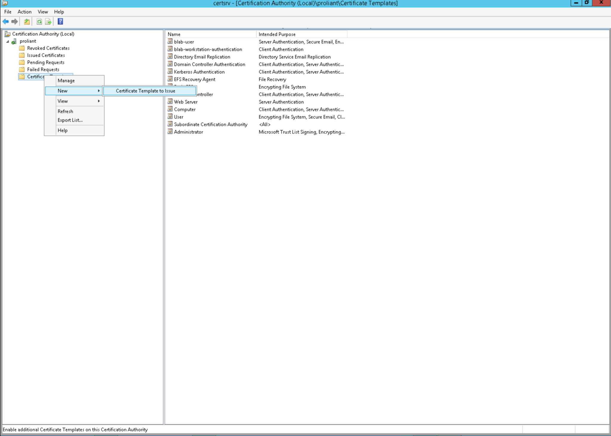

# opensight winrm configuration
Chocolatey Package 'opensight_winrm_configuration'
Automatic Configuration of WinRM Service for remote access. This script configures the WinRM Service according to our best practice.

# Features
The script configures the following settings
* **Configure WinRM Windows Service**<br>
  Make sure the service is enabled and startup is automatic
* **Configure Windows Firewall**<br>
  Allow traffic on port 5986 with rule 'Windows Remote Management (HTTPS)'
* **WinRM Listener Configuration and SSL Certificates**<br>
  Only allow encrypted traffic on port 5986. If possible, use the Cert from Domain CA (this has to be configured manually of course). If no CA Cert is available, create a self-signed cert (friendly name: 'OpensightWinRMHostCert')
* **WinRM Authentication Provider Configuration**<br>
  Make sure basic authentication is switched of and credssp is switched on

# Usage
This script can be used as a windows Powershell Logon Script.

You can create a chocolatey package when you have the [chocolatey agent](https://chocolatey.org/install) installed.

```
choco pack
choco install ./opensight_winrm_configuration.nupkg
```

# Setting up Domain CA

How to setup a CA in your domain, so that the winrm script can use the issued client certificate for traffic encryption.

* Install CA Role on a Server
* Clone the "Web Server" Template



Configure the following properties:

* “General” Tab<br/>
Name: WinRM
“Subject Name” Tab<br />
Check “Build from this Active Directory Information”
* “Subject name format”: “Common Name”<br />
Only check “DNS Name”
* “Security” Tab<br />
Domain Computers: Read, Enroll and Autoenroll Permission

Now deploy the certificate to all clients

